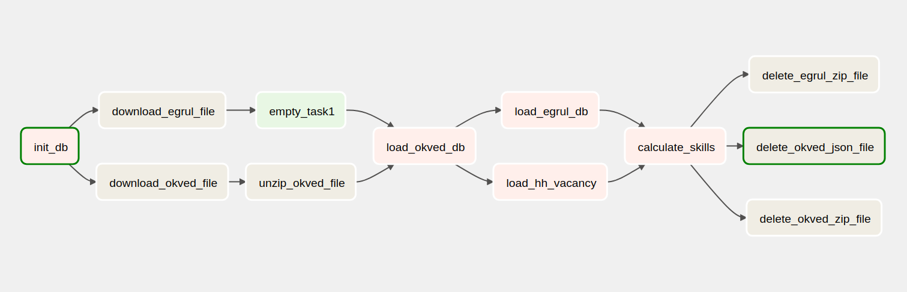

   
   

# Домашняя работа № 3. Python для ETL (итоговый проект)

## Системные требования
* Python >= 3.10
* Docker-compose >= 1.29.2

## Установка и запуск
* docker-compose up 

## Веб-интерфейс
* http://127.0.0.1:18080/
## Диаграмма пайплайна

